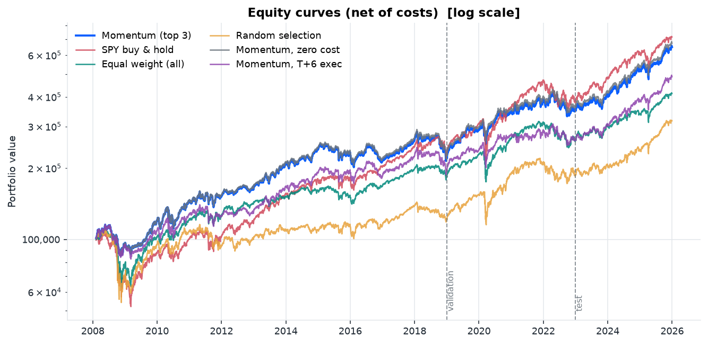

# Cross-Sectional ETF Momentum — Reproducible Research Platform

[](https://github.com/monishkk/quant-research-platform/actions/workflows/tests.yml)
[](https://www.python.org/)
[](LICENSE)

**[→ Read the full research report](https://monishkk.github.io/quant-research-platform/)**

A small, tested backtesting platform, built to evaluate one strategy properly rather than many
strategies badly — and rigorous enough to conclude that this one does not survive scrutiny.

The test case is **cross-sectional momentum on nine liquid US ETFs**: rank by trailing 12-month
return (skipping the most recent month), hold the top 3 equally weighted, rebalance monthly,
charge realistic costs, and compare against honest baselines across separated in-sample and
out-of-sample periods.

The strategy is deliberately unoriginal. It is an instrument for proving the research *process*
is correct — a novel signal evaluated with a broken backtest is worth less than a known signal
evaluated properly.

---

## Headline result

Full sample 2008-02-08 to 2025-12-30, real daily adjusted prices, 5 bps round-trip cost, T+1
execution:

| | Momentum (top 3) | SPY buy & hold | Equal weight | Random 3-of-9 |
|---|---|---|---|---|
| CAGR | 11.03% | **11.65%** | 8.27% | 6.67% |
| Volatility | **14.90%** | 19.93% | 15.79% | 18.62% |
| Sharpe | **0.78** | 0.65 | 0.58 | 0.44 |
| Max drawdown | **-26.18%** | -51.48% | -43.27% | -50.66% |
| Annual turnover | 4.33x | 0.00x | 0.00x | 15.82x |



**The honest reading — and the actual finding of this project:**

> **Excluding 2008, the Sharpe advantage over SPY falls from +0.124 to −0.015. It disappears.**

No other year moves the edge by more than 0.07. Over 2010–2025 the strategy slightly
*underperforms* SPY risk-adjusted (−0.053).

A stationary block bootstrap (5,000 paired resamples, 17-day mean block) puts the 95% confidence
interval on that +0.124 advantage at **[−0.243, +0.455]**, with **p = 0.485**. And because the
192-cell sensitivity grid is itself a search, the edge has to clear the best Sharpe that many
trials of pure noise would be expected to produce — a hurdle of **0.410**. Against it the
**Deflated Sharpe Ratio is 0.700**, short of the conventional 0.95 bar.

Two things cut the other way, and the report says so: the parameters were pre-committed from the
literature rather than picked from the grid, and the deflation assumes trials are independent when
neighbouring cells share most of their trades. But the direction of the result does not change.

Three further caveats the headline table hides:

- The strategy earned **less money** than SPY (11.03% vs 11.65%) — it won on risk, not return.
- Alpha is +5.47% but the information ratio is **−0.09**. Both are correct: alpha is
  beta-adjusted, the information ratio is not.
- It beat SPY in only **8 of 18 calendar years**.

What it *is*: a defensive cross-asset rotation. It gives up 6.7%/yr in rising markets (76% of the
sample) and gains 13.1%/yr in falling ones (21%). That is a coherent economic story, and it
explains the low beta, the halved drawdown, and the below-index return.

What did **not** fail: costs (0.014 of Sharpe), execution delay (0.11 at T+6), and the ranking
versus random selection (+0.34). The implementation is sound. The honest reading of a sound
implementation is that the effect is small and crisis-dependent.

A negative result, reported as one. Full write-up: [`reports/RESEARCH_REPORT.md`](reports/RESEARCH_REPORT.md)
(or the generated `reports/momentum/research_report.html`).

---

## Quick start

```bash
git clone https://github.com/monishkk/quant-research-platform.git && cd quant-research-platform
python -m venv .venv && .venv\Scripts\activate    # Windows
pip install -r requirements.txt && pip install -e .
```

Reproduce every artefact with one command:

```bash
python -m quant_platform.run --config configs/momentum.yaml
```

Run the test suite:

```bash
python -m pytest
```

165 tests, ~4 seconds. They are the reason to trust anything above.

---

## What one command produces

```
reports/momentum/
├── research_report.html        # self-contained 10-section report, images embedded
├── metrics.csv                 # strategy vs all baselines
├── in_vs_out_of_sample.csv     # training / validation / test splits
├── sensitivity.csv             # 192-combination parameter grid
├── regimes.csv                 # performance by market regime
├── calendar_years.csv          # year-by-year vs benchmark
├── leave_one_year_out.csv      # how much of the edge rests on any single year
├── significance.csv            # bootstrap CI, p-value, Deflated Sharpe, noise hurdle
├── strategy_timeseries.csv     # strategy + benchmark returns, turnover, costs, exposure
├── equity_curve.png            drawdown.png            rolling_sharpe.png
├── rolling_volatility.png      turnover.png            exposure.png
├── monthly_returns.png         sensitivity.png         in_vs_out_sample.png
├── bootstrap_sharpe.png        # where the observed edge sits in its own noise distribution
```

Useful flags:

| Flag | Effect |
|---|---|
| `--show-test` | reveal the withheld test split (use once, when the strategy is final) |
| `--no-cache` | force a fresh download instead of reading cached Parquet |
| `--skip-sensitivity` | skip the 192-combination grid |
| `--output-dir DIR` | write elsewhere |
| `-v` | debug logging |

---

## The four things that make this a backtest rather than a chart

### 1. One shift, in one place

```python
executed_weights = target_weights.shift(execution_lag)   # lag >= 1
gross_returns    = (executed_weights * asset_returns).sum(axis=1)
```

`prices.loc[t]` is the **close** at t, so `returns.loc[t]` is the return over `(t-1, t]` and is
not knowable until t closes. `target_weights.loc[t]` is what you *want* at the close of t. The
shift means the weights multiplying `returns.loc[t]` were fixed at the close of `t-1`, strictly
before that return existed.

`execution_lag=0` is permitted but emits a warning — it exists so the bias can be *measured*,
not shipped.

### 2. Rebalance dates are real trading days

The obvious implementation is wrong:

```python
monthly = scores.resample("ME").last()          # stamped on 31 January
daily   = monthly.reindex(prices.index).ffill()  # 31 Jan is a Sunday -> row dropped
```

The label is silently dropped and the forward-fill carries the *previous* month's weights — a
missed rebalance no assertion would catch. This platform resamples the index itself and takes the
last **actual** trading day of each period, so rebalance dates are always a subset of the price
index and the reindex is lossless.

### 3. The test period is withheld by default

The 192-combination sensitivity grid runs on the **training window only**. With that many cells, a
Sharpe of 1.5 somewhere in the grid is what noise alone produces. The test split is computed once,
written to CSV, and hidden from both the report and the console unless you pass `--show-test`.

### 4. Leave-one-year-out, which is what actually found the answer

A full-sample edge cannot distinguish a persistent effect from one good year attached to a decade
of nothing. Deleting one year at a time can:

```python
validation.leave_one_year_out(strategy_returns, benchmark_returns)
```

Every other diagnostic in this project said the strategy was fine. This one said the edge was
2008. It is the single highest-value check in the repository, and it is the reason the headline
above is a negative result rather than a Sharpe ratio.

---

## Repository layout

```
src/quant_platform/
├── data.py         download, validate, cache to Parquet, record provenance
├── returns.py      simple/log/cumulative returns, rolling volatility
├── signals.py      momentum score -> ranks -> target weights -> rebalance schedule
├── costs.py        turnover definition and the linear cost model
├── portfolio.py    the engine: execution lag, costs, equity curve
├── metrics.py      every performance statistic, implemented from its definition
├── validation.py   sample splits, baselines, sensitivity grid, regime analysis
├── reporting.py    matplotlib figures and the HTML report
├── narrative.py    the report's prose, with conclusions computed from the results
└── run.py          CLI entry point

tests/
├── test_data.py           schema, cleaning, validators, return identities
├── test_portfolio.py      engine accounting, costs, weights, reproducibility
├── test_metrics.py        every metric against an analytically known answer
├── test_no_lookahead.py   perturbation tests for causality
└── test_validation.py     splits, baselines, sensitivity, end-to-end determinism

notebooks/
├── 01_data_exploration.ipynb    adjusted vs unadjusted, coverage, correlations
├── 02_momentum_research.ipynb   signal construction, weights verified by hand
└── 03_results.ipynb             performance, splits, sensitivity
```

`returns.py` and `narrative.py` are additions to the original module plan: return transforms
deserve their own module rather than being mixed into `metrics.py`, and separating the report's
prose from its rendering keeps `reporting.py` about figures.

Notebooks call into `src/`. They do not contain the platform.

---

## Conventions, stated explicitly

Different backtest implementations produce different results for the same strategy, mostly
through undocumented convention choices. Ours:

| Choice | This platform | Why it matters |
|---|---|---|
| Price series | Adjusted close | Unadjusted reads a 2-for-1 split as -50% |
| Return type | Simple (arithmetic) | Portfolio returns are the weighted arithmetic mean; log returns do not aggregate cross-sectionally |
| Execution | T+1 close | Signal at close t, trade at close t+1 |
| Turnover | **Two-way**: `sum|Δw|` | Many papers quote one-way, exactly half. A 2x difference in turnover is a 2x difference in costs |
| Initial entry | Charged | Entering from cash is a real trade |
| Cost model | Linear, 5 bps of turnover | No impact, no drift, static spreads |
| Weight cap | Cap, residual to **cash** | Renormalising would ignore the limit it was asked to enforce |
| Warm-up | No position until the signal exists | A 1-name portfolio during warm-up is an artefact, not a decision |
| Sortino denominator | Full-sample | Dividing by the count of negative periods flatters strategies that rarely lose |
| VaR / CVaR | Returned as returns (negative = loss) | Avoids sign ambiguity |

---

## Known limitations

These are real and uncorrected:

- **Survivorship bias.** Fixed universe of ETFs that exist today. Small for these nine
  cross-asset funds; severe if you point this code at single-name equities without
  point-in-time index membership and delisting returns.
- **No weight drift.** Positions are assumed restored to target each period, so real turnover
  is slightly higher than modelled.
- **Optimistic costs.** No market impact, static spreads, no taxes. All bias the result in the
  strategy's favour.
- **Low breadth.** Three positions from nine assets caps the achievable information ratio
  regardless of signal quality.
- **One sample.** ~18 years, one market. For a monthly strategy the effective sample is closer
  to 180 independent observations than to 4,500 daily rows, so the standard error on Sharpe is
  roughly ±0.25. Differences smaller than that are not distinguishable from luck.

## Next experiments

1. **Volatility targeting** — scale exposure to constant ex-ante volatility. Best-documented
   improvement to base momentum.
2. **Risk-parity weighting** — equal-weighting GLD and QQQ gives equal capital, wildly unequal risk.
3. **Absolute-momentum overlay** — require a positive trailing return, not just a top-3 rank.
   Targets the failure mode where the "best" asset is still falling.
4. **Wider universe** — breadth is the binding constraint.
5. **Block bootstrap + Deflated Sharpe** — confidence intervals and a multiple-testing correction.
6. **Cross-check against VectorBT** — agreement is evidence the accounting is right.

---

## Data

Free adjusted ETF prices via `yfinance`. Raw and processed panels are cached to
`data/` as Parquet with a provenance sidecar recording source, symbols, date range,
and retrieval timestamp.

If the download fails, the pipeline falls back to a **seeded synthetic panel** so the full
pipeline and test suite still run offline. Every artefact from such a run is labelled — a result
from synthetic data is a test of the software, not a research finding.

## Requirements

Python 3.10+; pandas, NumPy, SciPy, Matplotlib, pyarrow, PyYAML, yfinance, pytest.
Verified on Python 3.12 with pandas 3.0 and NumPy 2.5.

## License

MIT
